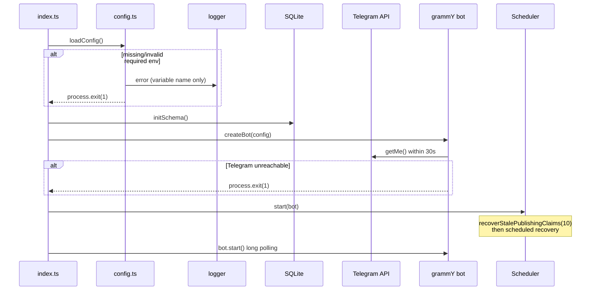
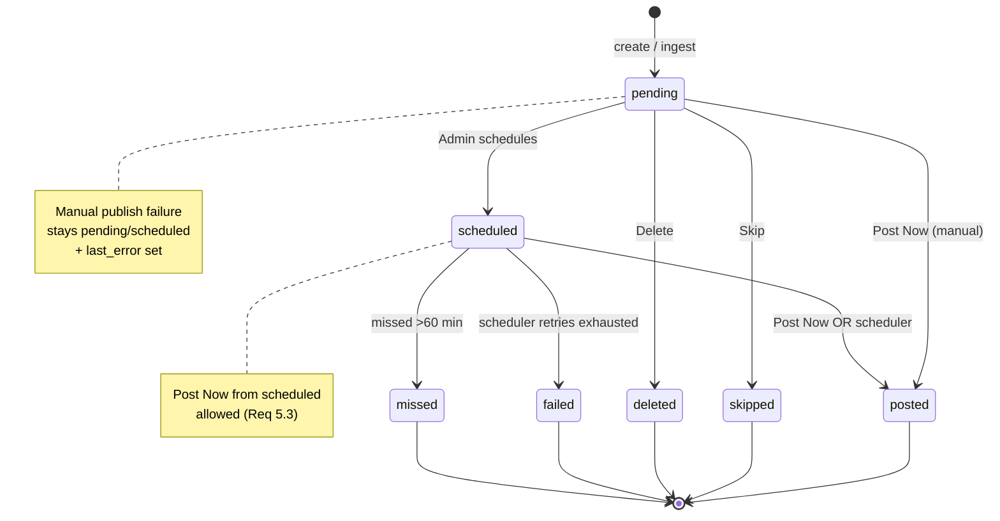
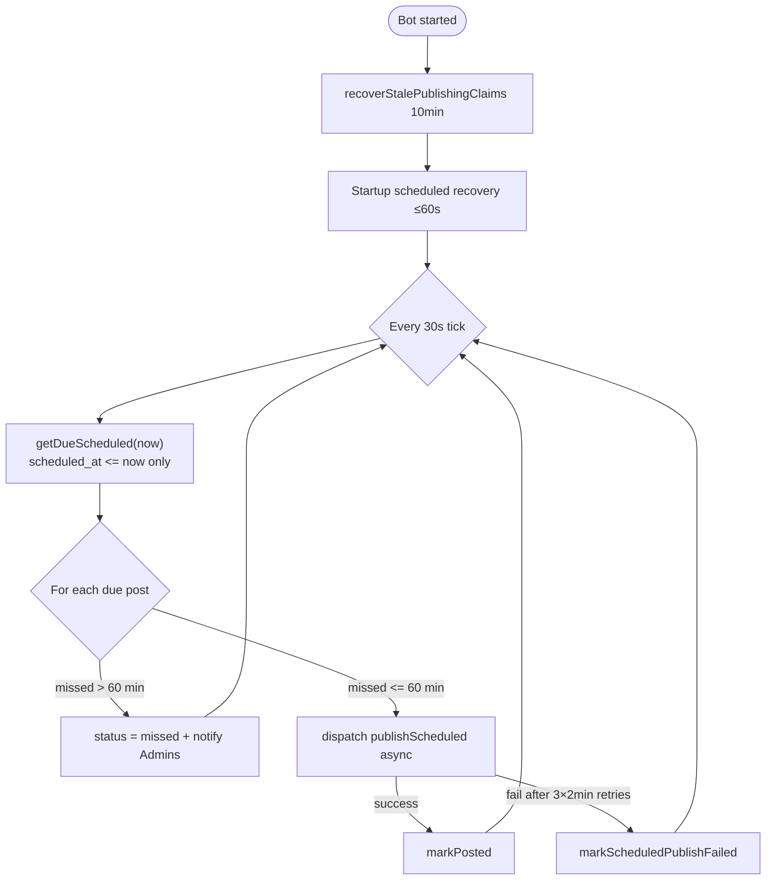
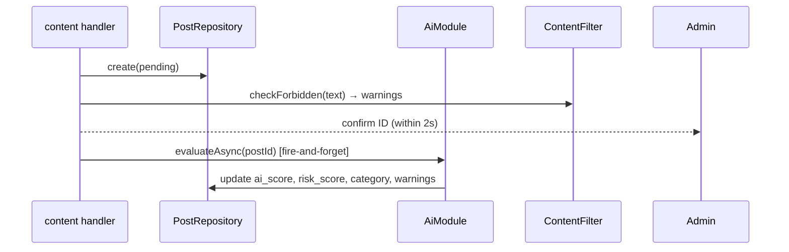
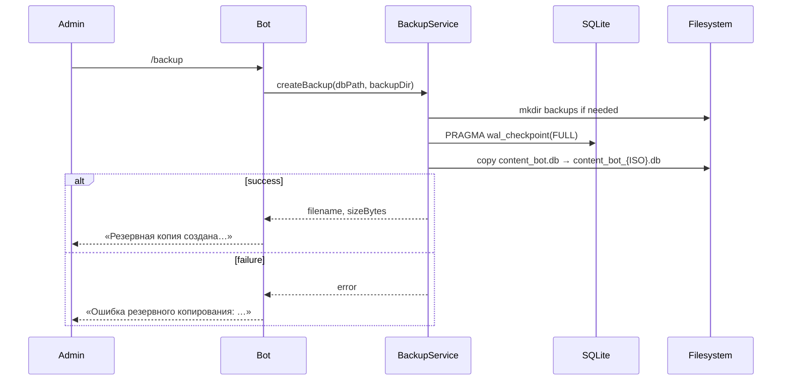

# Its a Match Content Bot — Architecture Document (v1)

## 1. Overview

### 1.1 Purpose

This document describes the technical architecture for **Its a Match Content Bot** — a standalone Telegram bot that moderates and publishes content to [@itsamatchchannel](https://t.me/itsamatchchannel).

Architecture aligns with [REQUIREMENTS.md](./REQUIREMENTS.md) v1.2. **No code is implied by this document alone**; it defines structure and behavior for implementation.

### 1.2 Technology Stack

| Layer | Choice | Rationale |
|-------|--------|-----------|
| Runtime | Node.js 20 LTS | Stable, good Docker support |
| Language | TypeScript | Type safety, maintainability |
| Telegram SDK | grammY | Modern API, middleware, long polling |
| Database | SQLite via `better-sqlite3` | Single-file persistence, no external DB service |
| AI (optional) | OpenAI official SDK | Requirement 9; disabled when key absent |
| Deployment | Docker multi-stage + Compose | Requirement 14; persistent volume |
| Update mode | Long polling only | No webhook, no HTTP server |

### 1.3 Architectural Principles

1. **Single process** — bot, scheduler, and services run in one Node.js process.
2. **Env-only configuration** — no `settings` table; all runtime config from environment variables.
3. **Fail fast at startup** — missing required env vars or Telegram unreachable → exit non-zero.
4. **Fail soft at runtime** — handler errors logged; process continues.
5. **Russian UI** — all Telegram user-facing strings in Russian; code and docs in English.
6. **v1 minimal surface** — no Source_Adapter, `/find`, web admin, webhook, or external integrations beyond optional OpenAI.

### 1.4 High-Level Component Diagram

```mermaid
flowchart TB
    subgraph External
        TG[Telegram API]
        OAI[OpenAI API optional]
        CH[@itsamatchchannel]
    end

    subgraph DockerContainer["Docker Container (content-bot)"]
        ENTRY[index.ts]
        CFG[config.ts]
        LOG[logger.ts]

        subgraph BotLayer["bot/"]
            AUTH[auth middleware]
            CMD[command handlers]
            MSG[message handlers]
            CB[callback handlers]
            SESS[session store]
            KB[keyboards / cards]
        end

        subgraph Services["services/"]
            REPO[PostRepository]
            PUB[PublisherService]
            SCHED[SchedulerService]
            FILT[ContentFilterService]
            TGWR[TelegramClient + retry]
            BAK[BackupService]
        end

        subgraph Optional["ai/ optional"]
            AI[AiModule]
        end

        DB[(SQLite posts table)]
        VOL[/app/data volume/]
    end

    ENTRY --> CFG
    ENTRY --> LOG
    ENTRY --> BotLayer
    ENTRY --> SCHED
    BotLayer --> AUTH
    AUTH --> CMD & MSG & CB
    CMD & MSG & CB --> Services
    CB --> SESS
    CB --> KB
    Services --> REPO
    PUB --> TGWR
    TGWR --> TG
    PUB --> CH
    AI -.-> OAI
    FILT --> AI
    REPO --> DB
    DB --> VOL
    BAK --> VOL
    SCHED --> PUB
```

---

## 2. Module Structure

### 2.1 Directory Layout

```
ItsAMatchContentBot/
├── src/
│   ├── index.ts                 # Entry: load config, init DB, start bot + scheduler
│   ├── config.ts                # Env parsing, validation, typed AppConfig
│   ├── logger.ts                # Structured JSON logger (stdout)
│   ├── types.ts                 # Shared types, enums, constants (categories, statuses)
│   │
│   ├── db/
│   │   ├── schema.ts            # DDL, migrations bootstrap, index creation
│   │   └── connection.ts        # SQLite open, pragmas (WAL, foreign_keys)
│   │
│   ├── bot/
│   │   ├── index.ts             # Bot factory, middleware registration, handler wiring
│   │   ├── session.ts           # In-memory per-admin conversation state
│   │   ├── keyboards.ts         # Inline keyboards, Moderation_Card formatter
│   │   ├── messages.ts          # Russian user-facing string constants
│   │   ├── middleware/
│   │   │   └── auth.ts          # Admin authorization gate
│   │   └── handlers/
│   │       ├── commands.ts      # /start, /help, /queue, /add, /poll, …
│   │       ├── content.ts       # Plain messages, media, forwards, URL-only
│   │       ├── moderation.ts    # Moderation_Card display, queue pagination
│   │       └── callbacks.ts     # Inline button actions (post, schedule, skip, …)
│   │
│   ├── services/
│   │   ├── posts.ts             # PostRepository — CRUD, stats, queue queries
│   │   ├── publisher.ts         # Publish orchestration, atomic claim, type dispatch
│   │   ├── scheduler.ts         # Tick loop, startup recovery, missed handling
│   │   ├── schedule-parser.ts   # DD.MM HH:mm parsing, TIMEZONE resolution
│   │   ├── content-filter.ts    # Keyword forbidden-category warnings
│   │   ├── telegram.ts          # API wrappers, retry with exponential backoff
│   │   └── backup.ts            # File copy to BACKUP_DIR
│   │
│   └── ai/
│       ├── module.ts            # AiModule — OpenAI calls when enabled
│       └── noop.ts              # No-op implementation when key absent (optional pattern)
│
├── Dockerfile
├── docker-compose.yml
├── .env.example
├── .gitignore
├── package.json
├── tsconfig.json
├── REQUIREMENTS.md
└── ARCHITECTURE.md
```

### 2.2 Module Responsibilities

| Module | Responsibility |
|--------|----------------|
| `config` | Parse and validate env; expose immutable `AppConfig` singleton at startup |
| `logger` | JSON logs; redact secrets from message fields |
| `db/schema` | Create `posts` table and indexes if not exist |
| `bot/*` | Telegram I/O, Russian UX, routing |
| `services/posts` | All SQL access to `posts` |
| `services/publisher` | Claim → Telegram send → status update |
| `services/scheduler` | Time-based publish and recovery |
| `services/content-filter` | Synchronous keyword warnings on ingest |
| `ai/module` | Async scoring, rewrite, classify; fire-and-forget on new Candidate |
| `services/backup` | WAL checkpoint + SQLite main file copy to `BACKUP_DIR` |

### 2.3 Dependency Rules

- `bot/handlers` → `services`, `ai`, `bot/keyboards`, `bot/session`, `bot/messages`
- `services` → `db`, `logger`, `config` (types only where possible)
- `ai` → `logger`, `config`; **must not** import `bot`
- `index.ts` wires everything; no circular imports

### 2.4 Explicitly Excluded from v1 Codebase

Per requirements and scope, the following **must not** appear as implemented modules:

- `sources/` or Source_Adapter
- `/find` handler
- HTTP server / webhook listener
- `settings` or `sources` database tables
- Redis, PostgreSQL, n8n, Mini App clients
- Direct API integration with the main Its a Match dating bot (only optional CTA copy via `MAIN_BOT_USERNAME`)

---

## 3. Configuration

### 3.1 AppConfig Shape

```typescript
interface AppConfig {
  contentBotToken: string;
  adminTelegramIds: number[];      // length 1–2
  channelUsername: string;         // without @
  databasePath: string;
  backupDir: string;
  timezone: string;                // IANA, default Europe/Warsaw
  openaiApiKey: string | null;
  mainBotUsername: string | null;
  queueWarningThreshold: 50;       // constant in v1, not env
}
```

### 3.2 Startup Sequence



---

## 4. Telegram Bot Layer

### 4.1 Bot Initialization

- Single `Bot` instance from grammY with token from `CONTENT_BOT_TOKEN`.
- Register middleware and handlers in fixed order (see §4.2).
- Global `bot.catch()` logs unhandled errors without crashing.
- Long polling via `bot.start()` — **no** `webhookCallback`, **no** Express/Fastify.

### 4.2 Middleware and Handler Order

```
1. authMiddleware          — all updates
2. command handlers        — /start, /help, /queue, …
3. callback handlers       — mod:*, queue:*, rewrite:*
4. session-aware message   — schedule input, edit caption (if session active)
5. content message handler — text, media, forwards (non-command)
```

Auth runs first so unauthorized users never reach business logic.

### 4.3 Command Handlers (`handlers/commands.ts`)

| Command | Handler behavior |
|---------|------------------|
| `/start` | Russian welcome + v1 command list (AI commands omitted if no key) |
| `/help` | Same command list as `/start` |
| `/queue` | Delegate to `moderation.showQueuePage(page=0)`; include queue warning if pending > 50 |
| `/add <text>` | Validate 1–4096 chars → create `text` Candidate → confirm + optional queue warning |
| `/poll Q \| A \| B …` | Parse pipes → validate → create `poll` Candidate |
| `/scheduled` | List up to 10 `scheduled`, sorted by `scheduled_at` ASC |
| `/posted` | List up to 10 `posted`, sorted by `posted_at` DESC with t.me links |
| `/stats` | Counts by status + today / 7d / all-time posted |
| `/testpost` | Send test message to channel via `telegram.sendTestMessage` |
| `/backup` | Invoke `BackupService.create()` → confirm filename + size |

**AI commands** (only registered when `openaiApiKey` present): `/ai_rewrite`, `/ai_score`, `/ai_classify`, `/ai_poll`, `/ai_cta`.

`/find` is **not registered** in v1.

### 4.4 Message Handlers (`handlers/content.ts`)

| Input | Action |
|-------|--------|
| Text (not command, not URL-only) | Create `text` Candidate |
| URL-only (full-message entity) | Validate URL → create `link` Candidate |
| Photo / video / animation | Store `file_id`, optional caption |
| Forward with accessible content | Map to appropriate type |
| Sticker, voice, document, audio, contact, location | Russian error: unsupported types |
| Session: `schedule` | Parse datetime → validate → set `scheduled` |
| Session: `edit_caption` | Update caption ≤1024 chars |

After create: run `content-filter` synchronously; enqueue async AI evaluation (non-blocking).

### 4.5 Callback Handlers (`handlers/callbacks.ts`)

| Callback prefix | Action |
|-----------------|--------|
| `queue:page:{n}` | Show Moderation_Card at page n |
| `mod:post:{id}` | Manual publish via `PublisherService.publishManual` |
| `mod:schedule:{id}` | Set session `schedule`; prompt formats (Russian) |
| `mod:rewrite:{id}` | AI rewrite → show 3 variants + pick buttons |
| `mod:edit:{id}` | Set session `edit_caption` |
| `mod:skip:{id}` | Status → `skipped`; show next |
| `mod:delete:{id}` | Status → `deleted`; show next |
| `rewrite:pick:{id}:{i}` | Apply variant i to caption |
| `rewrite:cancel:{id}` | Clear rewrite session |

### 4.6 Session Store (`bot/session.ts`)

In-memory `Map<adminUserId, SessionState>` — acceptable for 1–2 admins, single process.

```typescript
type SessionState =
  | { type: 'idle' }
  | { type: 'schedule'; postId: number }
  | { type: 'edit_caption'; postId: number }
  | { type: 'rewrite_select'; postId: number; variants: string[] };
```

Sessions cleared on completion or cancel. Lost on restart (Admin re-initiates action).

### 4.7 User-Facing Messages (`bot/messages.ts`)

Centralize Russian strings:

- `ACCESS_DENIED = 'Доступ запрещён'`
- Welcome, help, errors, schedule prompts, queue warnings, publish confirmations

Handlers import constants — no English strings sent to Admins.

### 4.8 Moderation Card (`bot/keyboards.ts`)

**Display fields:** id, type, category, source_url, caption/poll_question (truncated 200), ai_score, risk_score, last_error, scheduled_at, status, warnings.

**Buttons:** Post Now, Schedule, Rewrite, Edit Caption, Skip, Delete; Prev/Next when queue length > 1.

**Queue warning** (when pending count > 50): prepend e.g. `⚠️ В очереди {n} кандидатов (порог: 50).`

---

## 5. Admin Authorization Middleware

### 5.1 Design

```typescript
// bot/middleware/auth.ts
function authMiddleware(config: AppConfig): MiddlewareFn {
  return async (ctx, next) => {
    const userId = ctx.from?.id;
    if (!userId || !config.adminTelegramIds.includes(userId)) {
      if (ctx.callbackQuery) {
        await ctx.answerCallbackQuery({ text: ACCESS_DENIED });
      } else {
        await ctx.reply(ACCESS_DENIED);
      }
      logger.warn('auth', 'Unauthorized access', { userId });
      return; // do not call next()
    }
    await next();
  };
}
```

### 5.2 Properties

| Property | Behavior |
|----------|----------|
| Scope | All updates (messages, callbacks, media) |
| Failure mode | Fail closed — no handler execution |
| Callback response | Always `answerCallbackQuery` with **«Доступ запрещён»** |
| Logging | Log attempt with userId; never log tokens |
| Config source | `ADMIN_TELEGRAM_IDS` parsed once at startup |

---

## 6. SQLite Schema

### 6.1 v1 Scope

Single table: **`posts`**. No `settings`, no `sources`.

### 6.2 DDL

```sql
CREATE TABLE IF NOT EXISTS posts (
  id                    INTEGER PRIMARY KEY AUTOINCREMENT,
  type                  TEXT NOT NULL CHECK (type IN ('text','photo','video','animation','poll','link')),
  status                TEXT NOT NULL DEFAULT 'pending'
                        CHECK (status IN ('pending','scheduled','posted','skipped','deleted','failed','missed')),
  category              TEXT CHECK (category IS NULL OR category IN (
                          'dating_meme','relationship_joke','cat','news','poll',
                          'promo','quote','observation','link'
                        )),
  source_url            TEXT,
  media_file_id         TEXT,
  media_url             TEXT,
  caption               TEXT,
  raw_text              TEXT,
  ai_score              REAL,
  risk_score            REAL,
  risk_reason           TEXT,
  warnings              TEXT,             -- JSON array
  poll_question         TEXT,
  poll_options_json     TEXT,             -- JSON array of strings
  scheduled_at          TEXT,             -- ISO 8601 UTC stored; displayed in TIMEZONE
  posted_at             TEXT,
  telegram_message_id   INTEGER,
  last_error            TEXT,
  publishing_started_at TEXT,             -- publish claim flag; NULL when not publishing
  created_by            TEXT,
  created_at            TEXT NOT NULL,
  updated_at            TEXT NOT NULL,
  deleted_at            TEXT
);

CREATE INDEX IF NOT EXISTS idx_posts_status ON posts(status);
CREATE INDEX IF NOT EXISTS idx_posts_scheduled_at ON posts(scheduled_at) WHERE status = 'scheduled';
CREATE INDEX IF NOT EXISTS idx_posts_posted_at ON posts(posted_at) WHERE status = 'posted';
CREATE INDEX IF NOT EXISTS idx_posts_pending_created ON posts(created_at) WHERE status = 'pending';
CREATE INDEX IF NOT EXISTS idx_posts_publishing ON posts(publishing_started_at)
  WHERE publishing_started_at IS NOT NULL;
```

### 6.3 Storage Conventions

| Field | Convention |
|-------|------------|
| Timestamps | ISO 8601 UTC in DB; formatted to `TIMEZONE` for Admin display |
| `warnings` | JSON: `[{ "type": "category"\|"risk_score", "message": "…" }]` |
| `poll_options_json` | JSON: `["Option 1", "Option 2", …]` |
| `category` | One of predefined slugs (§6.4); enforced by CHECK constraint; NULL allowed until classified |
| `publishing_started_at` | ISO 8601 UTC timestamp set during active publish claim; NULL when idle |

### 6.4 Predefined Categories (constant in `types.ts`)

`dating_meme`, `relationship_joke`, `cat`, `news`, `poll`, `promo`, `quote`, `observation`, `link`

### 6.5 PostRepository Key Methods

| Method | Purpose |
|--------|---------|
| `create(input)` | Insert pending Candidate |
| `getById(id)` | Single row |
| `update(id, patch)` | Partial update + `updated_at` (non-publish fields) |
| `countPending()` | Queue size |
| `getPendingPage(offset, limit=1)` | Queue pagination ORDER BY `created_at ASC` |
| `getDueScheduled(nowIso)` | `status='scheduled' AND scheduled_at <= nowIso` (never publish before `scheduled_at`) |
| `claimPublishing(id)` | Atomic publish claim via `publishing_started_at` (§8.2); returns row + original status |
| `markPosted(id, messageId)` | `status='posted'`, set `telegram_message_id`, `posted_at`, clear `last_error` and `publishing_started_at` |
| `releasePublishingAfterManualFailure(id, originalStatus, error)` | Restore `originalStatus`, set `last_error`, clear `publishing_started_at` |
| `markScheduledPublishFailed(id, error)` | `status='failed'`, set `last_error`, clear `publishing_started_at` |
| `recoverStalePublishingClaims(olderThanMinutes)` | Find claims older than threshold; clear claim, keep status, set `last_error`, return affected rows for Admin notification |
| `getStats()` | Aggregations for `/stats` |

### 6.6 SQLite Pragmas

```sql
PRAGMA journal_mode = WAL;
PRAGMA foreign_keys = ON;
PRAGMA busy_timeout = 5000;
```

WAL supports concurrent reads during writes; `busy_timeout` helps scheduler + bot in one process.

---

## 7. Candidate Status State Machine

### 7.1 States

| Status | Terminal | Description |
|--------|----------|-------------|
| `pending` | No | In moderation queue |
| `scheduled` | No | Awaiting `scheduled_at` |
| `posted` | Yes | Successfully published |
| `skipped` | Yes | Admin skipped |
| `deleted` | Yes | Admin deleted |
| `failed` | Yes | Scheduled publish exhausted retries |
| `missed` | Yes | Scheduled window >60 min missed |

### 7.2 State Diagram



### 7.3 Valid Transitions

| From | Event | To | Notes |
|------|-------|-----|-------|
| `pending` | schedule | `scheduled` | Sets `scheduled_at` |
| `pending` | post_now (success) | `posted` | Clears `last_error`, `publishing_started_at` |
| `pending` | post_now (fail) | `pending` | `releasePublishingAfterManualFailure` |
| `pending` | skip | `skipped` | |
| `pending` | delete | `deleted` | Sets `deleted_at` |
| `scheduled` | post_now (success) | `posted` | |
| `scheduled` | post_now (fail) | `scheduled` | `releasePublishingAfterManualFailure` |
| `scheduled` | scheduler (success) | `posted` | |
| `scheduled` | scheduler (fail) | `failed` | `markScheduledPublishFailed` |
| `scheduled` | missed >60m | `missed` | No publish |
| `posted` | post_now | — | **Rejected** (already published) |

**Invalid:** Any transition from terminal states except none allowed.

### 7.4 Transition Enforcement

- All status changes go through `PostRepository` methods that validate `(from, to)` pairs.
- Repository throws `InvalidTransitionError` → handler catches → Russian error to Admin.

---

## 8. Publishing Flow

### 8.1 Overview

Publishing is centralized in **`PublisherService`**. Two entry points:

| Method | Trigger | On failure |
|--------|---------|------------|
| `publishManual(postId, adminId)` | ✅ Post Now callback | Keep `pending`/`scheduled`; set `last_error` |
| `publishScheduled(post)` | Scheduler tick | After retries → `failed`; set `last_error` |

### 8.2 Atomic Duplicate Protection

**Problem:** Two Admins (or Admin + Scheduler) may attempt to publish the same Candidate concurrently.

**Constraint:** **Never hold a SQLite transaction open while calling the Telegram API.** Network I/O inside a transaction would block other writers and increase deadlock risk.

**Solution:** Use `publishing_started_at` as a short-lived publish claim flag.

#### Claim column

| Column | Role |
|--------|------|
| `publishing_started_at` | ISO 8601 UTC timestamp; non-NULL means a publish is in progress |

#### `claimPublishing(id)` — inside a short transaction

```sql
BEGIN IMMEDIATE;

UPDATE posts
SET publishing_started_at = :now,
    updated_at = :now
WHERE id = :id
  AND status IN ('pending', 'scheduled')
  AND publishing_started_at IS NULL;

-- If changes === 0: ROLLBACK → reject concurrent/already-published attempt
-- Else: COMMIT and return row + original status

COMMIT;
```

**Rejection cases** (Russian message to Admin):

- `status` is not `pending` or `scheduled` (e.g. already `posted`)
- `publishing_started_at IS NOT NULL` (another publish in progress)

#### After claim — Telegram API **outside** any transaction

1. `claimPublishing(id)` → commit claim
2. Call Telegram API with retries (§8.5)
3. Finalize via one of the repository methods below (each in its own short transaction)

#### Finalization paths

| Outcome | Repository method | DB effect |
|---------|-------------------|-----------|
| Success | `markPosted(id, messageId)` | `status='posted'`, `telegram_message_id`, `posted_at`, `last_error=NULL`, `publishing_started_at=NULL` |
| Manual failure (Post Now) | `releasePublishingAfterManualFailure(id, originalStatus, error)` | Restore `originalStatus` (`pending` or `scheduled`), set `last_error`, `publishing_started_at=NULL` |
| Scheduled failure (retries exhausted) | `markScheduledPublishFailed(id, error)` | `status='failed'`, set `last_error`, `publishing_started_at=NULL` |

#### Concurrent attempt behavior

If Admin B calls `claimPublishing` while Admin A holds a non-NULL `publishing_started_at`:

- Update affects 0 rows → reject with Russian message (e.g. *«Публикация уже выполняется»* or *«Контент уже опубликован»* depending on re-read)

Exactly **one** Telegram message MUST reach the Channel per Candidate.

#### Stale publish claim recovery (mandatory)

If the process crashes after claim but before finalization, `publishing_started_at` may remain set and block republish. **Mandatory on every startup** (see §9.7): recover stale claims older than **10 minutes** — do **not** auto-publish; clear claim, keep `pending`/`scheduled`, set `last_error`, notify all Admins.

### 8.3 Publish Sequence (Manual)

```mermaid
sequenceDiagram
    participant Admin
    participant Bot
    participant Pub as PublisherService
    participant Repo as PostRepository
    participant TG as TelegramClient
    participant CH as Channel

    Admin->>Bot: callback mod:post:{id}
    Bot->>Pub: publishManual(id, adminId)
    Pub->>Repo: claimPublishing(id)
    alt claim rejected
        Repo-->>Pub: 0 rows
        Pub-->>Admin: «Уже опубликовано» / «Публикация выполняется»
    end
    Repo-->>Pub: row + originalStatus
    Note over Pub,TG: Transaction committed; no DB lock during API call
    loop up to 3 retries, 5s apart
        Pub->>TG: sendByType(candidate)
        TG->>CH: sendMessage/sendPhoto/…
    end
    alt success
        Pub->>Repo: markPosted(id, messageId)
        Pub-->>Admin: link t.me/channel/msg
    else failure
        Pub->>Repo: releasePublishingAfterManualFailure(id, originalStatus, error)
        Pub-->>Admin: error reason
    end
```

### 8.4 Telegram API Mapping by Type

| `type` | API method | Payload |
|--------|------------|---------|
| `text` | `sendMessage` | `caption` or `raw_text` |
| `link` | `sendMessage` | `source_url` (link preview enabled) |
| `photo` | `sendPhoto` | `media_file_id`, optional caption |
| `video` | `sendVideo` | `media_file_id`, optional caption |
| `animation` | `sendAnimation` | `media_file_id`, optional caption |
| `poll` | `sendPoll` | `poll_question`, options from `poll_options_json` |

Channel target: `@${CHANNEL_USERNAME}`.

Post link: `https://t.me/${CHANNEL_USERNAME}/${messageId}`.

### 8.5 Retry Policy

#### Publish retries (Telegram API)

| Path | Attempts | Interval between attempts | Final outcome |
|------|----------|---------------------------|---------------|
| **Manual Post Now** | 3 | 5 seconds (fixed) | `releasePublishingAfterManualFailure` — keep `pending` or `scheduled` |
| **Scheduled publish** | 3 | 2 minutes (fixed) | `markScheduledPublishFailed` — status → `failed` |

Manual and scheduled publish flows each perform up to **3 Telegram send attempts** with the intervals above. Transient API errors (429, 5xx, timeout) consume attempts; exhaustion triggers the final outcome row for that path.

#### Non-publish Telegram calls

Generic `telegram.ts` wrapper for non-publish operations (e.g. `/testpost`, `getMe`): up to **3 attempts** with exponential backoff `1s, 2s, 4s`.

#### Scheduler concurrency rule

Scheduled publish retries MUST **not** block the scheduler tick loop from processing other due posts. Each due post gets its own async publish task; the tick loop dispatches tasks without awaiting all retries for one post before starting the next (see §9.3).

---

## 9. Scheduler Design

### 9.1 Responsibilities

1. Poll for due `scheduled` Candidates (`scheduled_at <= now`)
2. Publish via `PublisherService.publishScheduled` (never before `scheduled_at`)
3. Mark windows missed by >60 minutes as `missed` and notify Admins
4. Recover scheduled posts on startup within 60 seconds
5. Rely on startup stale publish-claim recovery (§9.7) before processing due posts

### 9.2 Timing Constants

| Constant | Value |
|----------|-------|
| Tick interval | 30 seconds |
| Due condition | `scheduled_at <= now` (strict — **never** publish early) |
| Missed threshold | `now - scheduled_at > 60 minutes` |
| Startup recovery deadline | Within 60s of boot |
| Manual publish retry interval | 5 seconds, max 3 attempts |
| Scheduled publish retry interval | 2 minutes, max 3 attempts |
| Stale publish claim age | 10 minutes (mandatory startup recovery) |

### 9.3 Scheduler Decision Rules

For each `scheduled` Candidate, compare `scheduled_at` to `now`:

| Condition | Action |
|-----------|--------|
| `scheduled_at > now` | **Do nothing** — not due yet |
| `scheduled_at <= now` AND `now - scheduled_at <= 60 min` | **Publish** via `publishScheduled` |
| `scheduled_at <= now` AND `now - scheduled_at > 60 min` | **Mark `missed`**, notify all Admins (Russian); do not publish |

Posts MUST never be published before their `scheduled_at` timestamp.

### 9.4 Tick Algorithm

```
every 30s:
  now = current UTC time
  candidates = repo.getDueScheduled(now)   -- scheduled_at <= now only

  for each candidate (do not await other posts' retry loops):
    if candidate.status != 'scheduled': continue

    missedBy = now - candidate.scheduled_at

    if missedBy > 60min:
      repo.update status='missed'
      notify all admins (Russian)
    else:
      dispatch publishScheduled(candidate) asynchronously
      -- each task runs its own 3× retry / 2min cycle without blocking this loop
```

**Due query:** `getDueScheduled(nowIso)` executes:

```sql
SELECT * FROM posts
WHERE status = 'scheduled'
  AND scheduled_at <= :nowIso
ORDER BY scheduled_at ASC;
```

No lookahead window (no `now + 5 minutes`).

### 9.5 Startup Recovery

On `SchedulerService.start()`, within **60 seconds** of boot:

```
1. Run recoverStalePublishingClaims(10) — §9.7 (before scheduled processing)
2. candidates = getDueScheduled(now)   -- scheduled_at <= now only
3. For each candidate, apply §9.3 decision rules (same as tick)
```

Runs once, then the 30s tick loop takes over.

### 9.6 Scheduler Diagram



Posts with `scheduled_at > now` are excluded by the due query and are not processed until a later tick.

### 9.7 Stale Publishing Claim Recovery (Mandatory)

**When:** On every process startup, **before** scheduler processes due posts or bot accepts publish callbacks.

**Query:**

```sql
SELECT * FROM posts
WHERE publishing_started_at IS NOT NULL
  AND publishing_started_at < :cutoffIso;   -- now minus 10 minutes
```

**For each matching post:**

1. Do **NOT** publish to Telegram automatically
2. Clear `publishing_started_at` (set to NULL)
3. Keep current `status` unchanged (`pending` or `scheduled`)
4. Set `last_error` to a stale-claim message (Russian, e.g. interrupted publish recovered on restart)
5. Notify **all** Admins via bot private message (Russian)

Implemented as `PostRepository.recoverStalePublishingClaims(10)` called from `index.ts` or `SchedulerService.start()` before due-post processing.

### 9.8 Schedule Input Parsing (`schedule-parser.ts`)

**Accepted formats:**

- `DD.MM HH:mm` — e.g. `25.01 14:30`
- `DD.MM.YYYY HH:mm` — e.g. `25.01.2026 14:30`

**Algorithm:**

1. Regex match format
2. If year omitted → use current year in `TIMEZONE`
3. Construct datetime in `TIMEZONE` (use `Intl` or `Temporal` polyfill pattern)
4. Convert to UTC ISO for storage in `scheduled_at`
5. Reject if resolved time < now + 5 minutes
6. Reject if resolved time > now + 30 days
7. Reject if resolved time in the past

Display confirmation: `DD.MM.YYYY HH:mm` in configured timezone (Russian locale formatting).

---

## 10. AI Module (Optional Integration)

### 10.1 Activation

```typescript
const ai = config.openaiApiKey
  ? new AiModule(config.openaiApiKey, config.mainBotUsername)
  : null;
```

When `null`:

- AI commands not registered
- ♻️ Rewrite button responds: AI unavailable (Russian)
- No Risk_Score / AI_Score / classify on ingest
- Bot starts without error (Req 1.14, 9.2)

### 10.2 AiModule Interface

| Method | Used by | Timeout |
|--------|---------|---------|
| `rewriteCaption(text)` → 3 strings | Rewrite callback, `/ai_rewrite` | 30s (15s UX target for card) |
| `scoreContent(text)` → 1–10 | `/ai_score`, background | 30s |
| `assessRisk(text)` → score + reason | Background on create | 30s |
| `classify(text)` → category slug | `/ai_classify`, background | 30s |
| `generatePoll(seed)` → question + options | `/ai_poll` | 30s |
| `generateCta()` → string ≤200 | `/ai_cta` | 30s |

### 10.3 Background Evaluation on Create



Fire-and-forget must catch errors internally; never crash bot.

### 10.4 Rewrite Flow on Moderation Card

1. Admin presses ♻️ Rewrite
2. `AiModule.rewriteCaption(caption)` → 3 variants
3. Display variants + inline buttons `rewrite:pick:{id}:{0|1|2}`
4. Admin picks → update `caption` → clear session

### 10.5 MAIN_BOT_USERNAME

Used **only** in CTA prompt context for OpenAI — not a live integration with the dating bot.

---

## 11. Content Filtering

### 11.1 Keyword Filter (`content-filter.ts`)

Synchronous check on ingest text (caption, raw_text, source_url):

- Match against forbidden category keyword lists
- Append to `warnings` JSON — **does not block** creation
- Admin sees warnings on Moderation_Card

### 11.2 AI Risk Threshold

When `risk_score > 7`: append warning with `risk_reason` to `warnings`.

---

## 12. Docker and Runtime Layout

### 12.1 Container Structure

```yaml
# docker-compose.yml (conceptual)
services:
  content-bot:
    build: .
    restart: unless-stopped
    env_file: .env
    environment:
      DATABASE_PATH: /app/data/content_bot.db
      BACKUP_DIR: /app/data/backups
    volumes:
      - content-bot-data:/app/data
volumes:
  content-bot-data:
```

### 12.2 Dockerfile (Multi-Stage)

| Stage | Purpose |
|-------|---------|
| `builder` | `npm ci`, compile native deps, `tsc` |
| `production` | `npm ci --omit=dev`, copy `dist/`, run `node dist/index.js` |

Both stages use pinned **`node:20-bookworm-slim`**. Native modules such as `better-sqlite3` are more reliable on Debian slim than Alpine/musl.

### 12.3 Filesystem Layout Inside Container

```
/app/
├── dist/                    # Compiled JS
├── node_modules/            # Production deps only
└── data/                    # Volume mount
    ├── content_bot.db       # SQLite (DATABASE_PATH)
    └── backups/             # BACKUP_DIR
        └── content_bot_2026-06-28T12-00-00.db
```

### 12.4 Network

| Direction | Port | Purpose |
|-----------|------|---------|
| Outbound | 443 | Telegram API, OpenAI API |
| Inbound | **None** | No HTTP server |

### 12.5 Process Model

- **One container, one process**
- Long polling holds outbound connection to Telegram
- Scheduler uses `setInterval` in same event loop
- SQLite WAL handles concurrent bot + scheduler access

---

## 13. Error Handling and Logging

### 13.1 Logging Format

JSON to stdout:

```json
{
  "timestamp": "2026-06-28T14:30:00.000Z",
  "level": "info",
  "module": "publisher",
  "message": "Post published",
  "postId": 42,
  "messageId": 1234
}
```

### 13.2 Log Levels

| Level | Usage |
|-------|-------|
| `info` | Startup, publish success, backup created |
| `warn` | Unauthorized access, AI skipped, queue warning |
| `error` | Publish failure, DB error, Telegram exhausted retries |
| `debug` | Retry attempts (optional, default off in prod) |

### 13.3 Secret Redaction

`logger.ts` MUST redact patterns matching:

- Bot tokens
- `sk-…` OpenAI keys
- Env var assignments in error messages

Log variable **names** only (e.g. `Missing required environment variable: CONTENT_BOT_TOKEN`).

### 13.4 Error Handling Layers

| Layer | Behavior |
|-------|----------|
| Startup validation | `process.exit(1)` |
| `bot.catch()` | Log + continue polling |
| Handler try/catch | Russian reply to Admin + log |
| Telegram retry wrapper | 3 attempts → throw |
| AI fire-and-forget | Catch + log warn; no Admin impact |
| Scheduler tick | Catch per-post; continue loop |

### 13.5 User-Facing Errors

Always Russian, actionable where possible:

- Invalid schedule format → list accepted formats + timezone
- Publish failure → include sanitized reason (no token leaks)
- AI timeout → «AI недоступен» / timeout reason

---

## 14. Backup Flow

### 14.1 Trigger

Admin command `/backup`.

### 14.2 Sequence



### 14.3 Implementation Notes

- **WAL mode:** A plain file copy of the main `.db` file alone is **not** guaranteed consistent while WAL frames exist. Backup MUST run `PRAGMA wal_checkpoint(FULL)` first to flush WAL content into the main database file.
- After successful checkpoint, copy **only** the main database file (e.g. `content_bot.db`) to `BACKUP_DIR`. Do not copy `-wal`/`-shm` sidecar files into the backup artifact.
- Use `fs.copyFile` (or equivalent) for the checkpointed main file.
- Filename pattern: `content_bot_{YYYY-MM-DDTHH-mm-ss}.db`
- No automatic scheduled backups in v1
- If checkpoint fails, abort backup and return error to Admin (do not produce a partial backup silently)

---

## 15. Test Strategy

Tests map directly to [REQUIREMENTS.md §12 Test Plan](./REQUIREMENTS.md#12-test-plan).

### 15.1 Test Levels

| Level | Scope | Tools (recommended) |
|-------|-------|---------------------|
| Unit | schedule-parser, state transitions, content-filter, config validation | Node test runner / Vitest |
| Integration | PostRepository + SQLite in-memory/temp file | Vitest + better-sqlite3 |
| Service | PublisherService claim logic with mocked Telegram | Vitest mocks |
| Manual E2E | Full bot against test channel + test bot token | Docker + Telegram clients |

v1 does **not** require CI automation in architecture; manual E2E acceptable for 1–2 admins.

### 15.2 Test Mapping Table

| Test ID | Architecture component under test | Verification approach |
|---------|-----------------------------------|------------------------|
| **TP-1.1** | `index.ts`, `config.ts`, Docker | Manual: `docker compose up`, `/start` |
| **TP-1.2** | `config.ts` | Unit: missing token → throw/exit |
| **TP-1.3** | `config.ts` | Unit: invalid admin IDs |
| **TP-1.4** | `bot/index.ts`, `ai/module` | Integration: start without key, no AI commands |
| **TP-1.5** | Docker volume, `scheduler.ts` recovery, stale claim recovery | Manual: restart container; verify data, stale claims cleared, scheduled recovery |
| **TP-2.1** | `auth.ts` | Manual/Integration: non-admin `/start` |
| **TP-2.2** | `auth.ts` | Manual: non-admin callback |
| **TP-2.3** | `commands.ts` | Manual: admin `/start` Russian list |
| **TP-3.1** | `content.ts`, `posts.ts` | Integration: text create |
| **TP-3.2** | `content.ts` URL detection | Unit: URL-only entity → type `link` |
| **TP-3.3** | `content.ts` | Unit: invalid URL rejected |
| **TP-3.4** | `content.ts` | Integration: photo + caption |
| **TP-3.5** | `content.ts` | Manual: sticker → unsupported message |
| **TP-3.6** | `commands.ts` `/poll` | Unit: parse pipe format |
| **TP-3.7** | `commands.ts` | Unit: 1 option → error |
| **TP-4.1** | `moderation.ts`, `keyboards.ts` | Manual: `/queue` |
| **TP-4.2** | `publisher.ts` | E2E: text publish |
| **TP-4.3** | `publisher.ts` poll branch | E2E: sendPoll |
| **TP-4.4** | `publisher.ts` link branch | E2E: link publish |
| **TP-4.5** | `claimPublishing`, state machine | Integration: double post rejected |
| **TP-4.6** | `publishing_started_at` claim | Integration: concurrent publish simulation |
| **TP-4.7** | `releasePublishingAfterManualFailure` | Mock Telegram fail → status unchanged, `last_error` set, claim cleared |
| **TP-4.8** | `callbacks.ts` skip/delete | Manual |
| **TP-4.9** | `moderation.ts` queue warning | Integration: seed 51 pending → warning text |
| **TP-4.10** | `content.ts` post-create | Integration: confirm message includes warning |
| **TP-5.1** | `schedule-parser.ts` | Unit: full date format |
| **TP-5.2** | `schedule-parser.ts` | Unit: year default |
| **TP-5.3** | `schedule-parser.ts` | Unit: past date rejected |
| **TP-5.4** | `schedule-parser.ts` | Unit: ISO format rejected |
| **TP-5.5** | `scheduler.ts` due query | Unit: post with `scheduled_at > now` not selected |
| **TP-5.6** | `scheduler.ts` | E2E/Manual: wait until `scheduled_at`; publish only after due |
| **TP-5.7** | `scheduler.ts` missed logic | Unit: >60 min → missed |
| **TP-5.8** | `markScheduledPublishFailed`, async dispatch | Mock fail → `failed`; other due posts still processed same tick |
| **TP-5.9** | `recoverStalePublishingClaims` | Integration: stale claim >10 min cleared; status kept; Admins notified; no auto-publish |
| **TP-6.1** | `posts.getStats` | Integration |
| **TP-6.2–6.4** | `commands.ts` | Manual E2E |
| **TP-6.5** | `backup.ts` WAL checkpoint + file copy | Manual E2E: `/backup` after writes; verify restorable copy |
| **TP-6.6** | Handler registration | Unit: `/find` not in command list |
| **TP-7.1–7.4** | `ai/module.ts` | Manual with key; mock for timeout |
| **TP-8.1** | `logger.ts` | Unit: redaction |
| **TP-8.2** | Deployment | Manual: `netstat`/no listen ports |
| **TP-8.3** | Repo hygiene | Check `.gitignore` |

### 15.3 Priority for Implementation Phase

1. **P0 — Unit:** config, schedule-parser, state transitions, `claimPublishing` / claim rejection
2. **P0 — Integration:** PostRepository publish methods, publisher failure paths, backup checkpoint
3. **P1 — Manual E2E:** auth, publish all types, scheduler, backup
4. **P2 — AI E2E:** optional path with real OpenAI key

---

## 16. Security Architecture Summary

| Concern | Mitigation |
|---------|------------|
| Unauthorized access | Auth middleware on all updates |
| Secret leakage | Env-only secrets; log redaction |
| Duplicate publish | `publishing_started_at` claim + short DB transactions; no API inside transactions |
| Stale publish claim | Mandatory startup recovery; clear claim after 10 min; no auto-publish |
| Injection | Parameterized SQL only (`better-sqlite3` prepared statements) |
| Attack surface | No inbound ports; long polling outbound only |
| Data persistence | Docker volume; `/backup` manual copies |

---

## 17. Out of Scope (Architecture)

The following must **not** be designed or implemented in v1:

- `/find`, Source_Adapter, external fetch pipelines
- Web admin, webhook mode, HTTP server
- PostgreSQL, Redis, n8n, Telegram Mini App
- Main Its a Match bot API integration (CTA text only via env)
- Media groups / albums (Phase 1.5)
- `settings` / `sources` tables
- Automatic backup cron
- Horizontal scaling / multi-instance (single process assumed)

---

## 18. Document History

| Version | Date | Changes |
|---------|------|---------|
| 1.0 | 2026-06-28 | Initial architecture for v1 based on REQUIREMENTS.md v1.2 |
| 1.1 | 2026-06-28 | Publish claim via `publishing_started_at`; WAL checkpoint backup; bookworm-slim base image; category CHECK; renamed repository publish methods |
| 1.2 | 2026-06-28 | Scheduler due query `scheduled_at <= now`; mandatory stale claim recovery; retry policy and non-blocking scheduled retries clarified |
